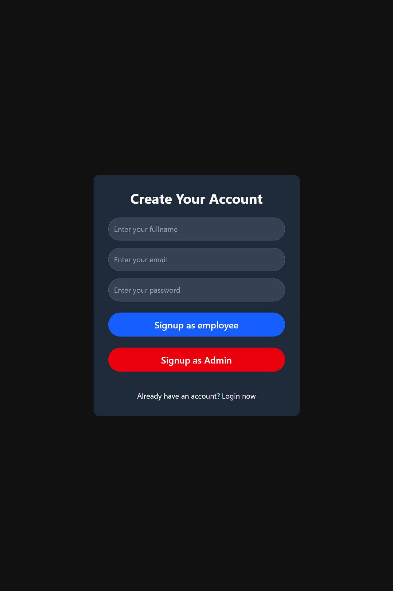
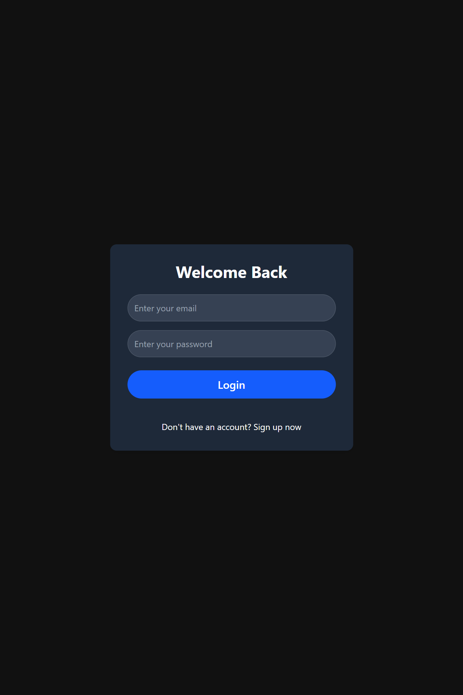

# Employee Management System





## Overview
Employee Management System is a full-stack application for managing employee profiles, authentication, and task assignments. The backend is built using Node.js, Express, and MongoDB while the frontend uses React with Zustand for state management.

## Table of Contents
- [Installation](#installation)
- [Environment Variables](#environment-variables)
- [Backend API Endpoints](#backend-api-endpoints)
  - [Authentication](#authentication)
  - [Profile](#profile)
  - [Task Management](#task-management)
- [Frontend Functionalities](#frontend-functionalities)
- [Project Structure](#project-structure)
- [Dependencies](#dependencies)
- [License](#license)

## Installation
1. Clone the repository.
2. For the backend, navigate to the `/backend` folder and run:
   ```
   npm install
   npm start
   ```
3. For the frontend, navigate to the `/ems` folder and run:
   ```
   npm install
   npm run dev
   ```

## Environment Variables
Create a `.env` file in the backend directory with the following:
```
PORT=3000
JWT_SECRET="your_jwt_secret"
DB_CON="your_mongodb_connection_string"
```
*Add any additional variables as needed.*

## Backend API Endpoints

### Authentication

#### Sign Up
- **URL:** `/api/emp/signup`
- **Method:** `POST`
- **Description:** Registers a new employee.
- **Request Body:**
  ```json
  {
    "fullname": "John Doe",
    "email": "john@example.com",
    "password": "password123",
    "isAdmin": false
  }
  ```
- **Response:**
  ```json
  {
    "token": "jwt_token",
    "employee": { /* employee details */ }
  }
  ```

#### Login
- **URL:** `/api/emp/login`
- **Method:** `POST`
- **Description:** Authenticates an employee and returns a JWT token.
- **Request Body:**
  ```json
  {
    "email": "john@example.com",
    "password": "password123"
  }
  ```
- **Response:**
  ```json
  {
    "token": "jwt_token",
    "employee": { /* employee details */ }
  }
  ```

#### Logout
- **URL:** `/api/emp/logout`
- **Method:** `GET`
- **Description:** Logs out an employee by clearing the authentication token.
- **Response:**
  ```json
  {
    "message": "Logged out successfully"
  }
  ```

### Profile

#### Get Profile
- **URL:** `/api/emp/profile`
- **Method:** `GET`
- **Description:** Retrieves the authenticated employee's profile.
- **Response:**
  ```json
  {
    "_id": "employee_id",
    "fullname": "John Doe",
    "email": "john@example.com"
    // ...other profile details
  }
  ```

### Task Management

#### Assign Task
- **URL:** `/api/emp/assign/:name`
- **Method:** `PUT`
- **Description:** Assigns a new task to an employee.
- **Request Body:**
  ```json
  {
    "taskTitle": "Design UI",
    "taskDescription": "Create responsive dashboard UI",
    "taskDate": "2023-10-01T00:00:00.000Z",
    "category": "UI/UX"
  }
  ```
- **Response:**
  ```json
  {
    "message": "Task added successfully",
    "employee": { /* updated employee object with tasks */ }
  }
  ```

#### Get All Employees
- **URL:** `/api/emp/all-profile`
- **Method:** `GET`
- **Description:** Fetches a list of all non-admin employees along with their tasks.
- **Response:**
  ```json
  [
    { /* employee object */ },
    // ...other employees
  ]
  ```

## Frontend Functionalities

### User Authentication
- **Login & Signup:** Forms for user registration and authentication. JWT tokens are stored in localStorage.

### Dashboard
- **Employee Dashboard:** Displays the logged in employee’s profile and their tasks.
- **Admin Dashboard:** Provides an overview of all employees and enables task assignment.

### Task Management
- **All Tasks Component:** Renders tasks for each employee by fetching data from `/api/emp/all-profile`.

### Routing & State Management
- Protected routes separate admin and employee views.
- Zustand is used to manage state and share authentication data across components.

## Project Structure
```
/backend
   ├── controllers
   │    └── EmpContoller.js
   ├── middleware
   │    └── authMiddleware.js
   ├── models
   │    ├── EmpModel.js
   │    └── AdminModel.js
   ├── routes
   │    └── EmpRoutes.js
   ├── db
   │    └── db.js
   ├── app.js
   └── server.js

/ems
   ├── src
   │    ├── components
   │    │    ├── Auth (Login.jsx, Signup.jsx)
   │    │    ├── Dashboard (EmpDashboard.jsx, AdminDashboard.jsx)
   │    │    └── other (AllTask.jsx)
   │    ├── pages
   │    └── store (useAuthStore.js)
   └── App.jsx
```

## Dependencies
- **Backend:**
  - express
  - mongoose
  - jsonwebtoken
  - bcryptjs
  - cors
  - cookie-parser
  - dotenv
- **Frontend:**
  - react
  - zustand
  - axios
  - react-router

## License
This project is licensed under the MIT License.
